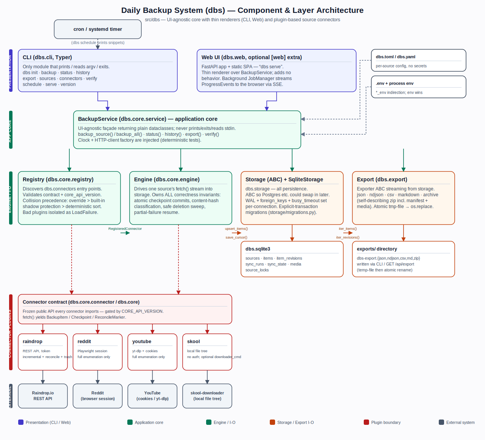
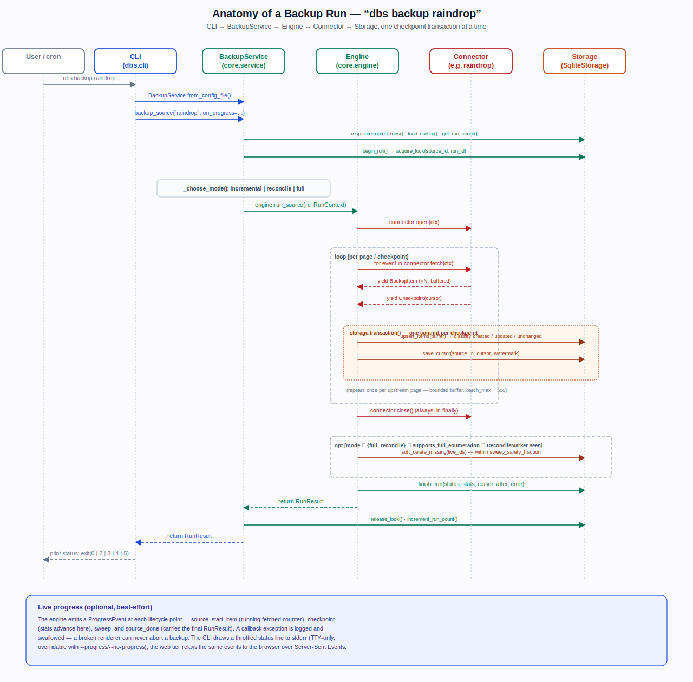
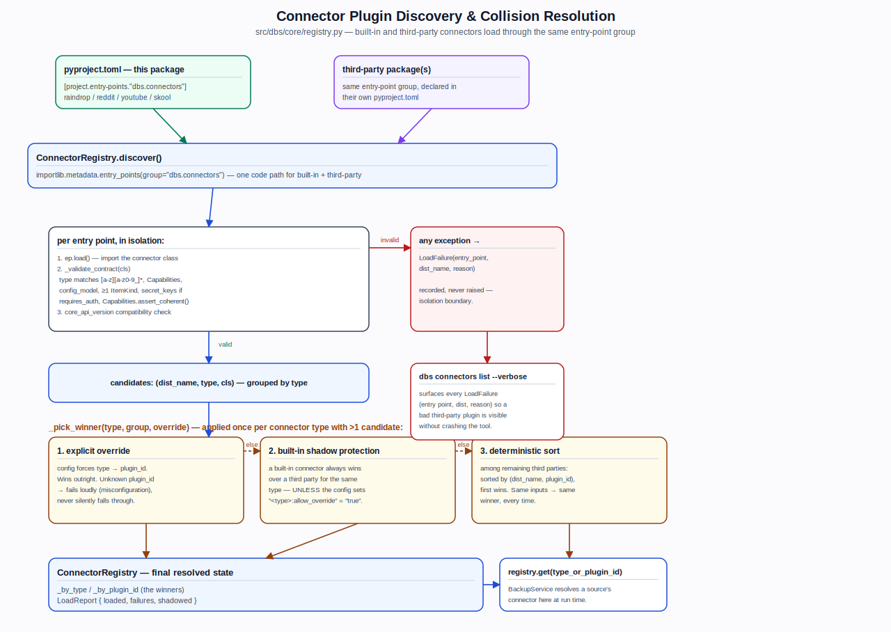
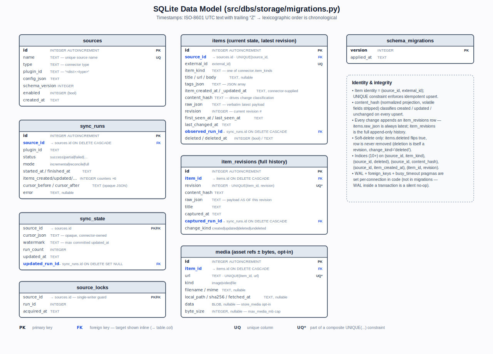

# Architecture

Daily Backup System (`dbs`) is a single Python package (`src/dbs`) with a
UI-agnostic application core, a plugin model for sources, and two thin
renderers (a CLI and an optional local web UI) that share that core unchanged.
This document is the system-level reference; diagrams referenced below live in
[`docs/diagrams/`](diagrams/) as standalone SVGs. For the evaluative deep dive
(as-built review, strengths, tensions, risks) see
[architecture-analysis.md](architecture-analysis.md); for the engineering
principles the code practices see [coding-philosophy.md](coding-philosophy.md);
for the improvement roadmap see [ROADMAP.md](ROADMAP.md).

## System overview

- **`dbs.core` (public contract).** The only thing connectors import. Frozen by
  `CORE_API_VERSION`. Exposes `Connector`, the models a connector emits/receives,
  `Secrets`, `ManagedHTTPClient`, and helpers.
- **`BackupService` (application core, `dbs.core.service`).** UI-agnostic façade
  returning plain dataclasses; never prints, exits, or reads stdin. The clock and
  HTTP factory are injected for deterministic tests. The CLI and the web tier are
  both thin renderers over it.
- **`Registry` (`dbs.core.registry`).** Entry-point discovery with isolation,
  contract validation, version gating, and collision precedence — see
  [Plugin discovery](#plugin-discovery-the-connector-contract) below.
- **`Engine` (`dbs.core.engine`).** Drives one source's `fetch()` stream into
  storage, enforcing the correctness invariants below. It is the only code that
  writes to `items`/`item_revisions`/`sync_state`.
- **`Storage` (ABC) + `SqliteStorage` (`dbs.storage`).** All persistence. An ABC
  so a future deployment can swap SQLite for Postgres without touching the core.
- **`Export` (`dbs.export`).** Pluggable exporters streaming from storage:
  json / ndjson / csv / markdown / obsidian (a vault of linked notes) / a
  self-describing zip `archive`.
- **`dbs.cli` (Typer).** The only module that prints, reads argv, or sets exit
  codes. Maps 1:1 onto `BackupService` methods.
- **`dbs.web` (optional, `[web]` extra).** A FastAPI app (`dbs serve`) that
  renders the same `BackupService` over HTTP plus a static single-page UI. Adds
  no behavior of its own. Long backups run in a background thread
  (`JobManager`) and stream their `ProgressEvent`s to the browser over
  Server-Sent Events. Its deps (`fastapi`, `uvicorn`) live behind the `[web]`
  extra; the core never imports them. Each request uses a fresh
  `BackupService` (the SQLite connection is single-thread). Secrets set from
  the UI go through `dbs.web.envfile` into `.env` (never the config),
  restricted to names a connector declares as a secret, and are never read
  back — the secrets API reports only set/unset status. It binds to localhost
  by default (local, single-user use) behind a small security gate: non-local
  `Host` headers are rejected (DNS-rebinding defense), cross-origin
  state-changing requests are blocked (CSRF defense), and a non-localhost
  bind requires `dbs serve --token`, which gates every `/api` call on a
  bearer token (header or `?token=` for `EventSource`/downloads). Optional
  **setup actions** (`dbs.web.setup`) can install a connector's declared
  `pip_requirements` and run a connector's declared interactive **auth
  capture** as background jobs; the executed commands are derived from
  connector metadata, never from client input. This is **on by default**
  (`dbs serve --allow-setup`, the default) and disabled with `dbs serve
  --no-setup`. Connectors declare their optional runtime deps
  (`pip_requirements` / `runtime_imports` / `needs_playwright_browser`) and a
  `check_ready()` probe, and may declare an `AuthCapture` (kind
  `browser_session` → a Playwright session dir, or `browser_cookies` → a
  Netscape `cookies.txt`) naming the `*_env` secret it populates. The web
  layer owns the (Playwright) browser automation per kind; the connector
  stays UI-agnostic and the core still installs/launches nothing itself. A
  separate, ad-hoc **Research** tab (backed by `dbs.research`, its own
  `[research]` extra and a third `AuthCapture`-like `browser_storage_state`
  capture for NotebookLM) reuses the same job/SSE/setup machinery but sits
  outside the `BackupService`/connector model entirely — see
  [docs/research.md](research.md).

## Anatomy of a backup run

`dbs backup raindrop` (or `--all`, or the equivalent `POST /api/backup`) walks
through `BackupService.backup_source()` → `Engine.run_source()` →
`Connector.fetch()`, with the engine driving every write. The correctness
invariants below are why the engine — not each connector — owns persistence:

1. **The cursor never gets ahead of data.** Buffered items + the new cursor are
   committed in one transaction per `Checkpoint`. A crash leaves the cursor
   *lagging* data at worst; the next run re-fetches the overlap and the
   idempotent upsert dedups it (counted "unchanged").
2. **Forward progress on partial failure.** If the stream raises after some
   checkpoints, the run is `partial` (not `failed`) and resumes next time.
3. **Idempotent, classified upserts.** Identity is `(source_id, external_id)`.
   A content hash over a normalized projection (volatile fields stripped) decides
   created / updated / unchanged. Every change writes an `item_revisions` row
   that stores the raw payload *as of that revision*, so history is fully
   reconstructable. `items.raw_json` always holds the latest verbatim payload.
4. **Deletion only when safe.** Soft-delete is gated on
   `supports_full_enumeration`: a delta-only feed can never falsely delete data.
   A reconcile sweep runs only after a *successful* full/reconcile run; an
   interrupted run never sweeps. The sweep itself additionally refuses to
   delete more than `sweep_safety_fraction` (default 50%) of a source's live
   items in one pass — a truncated upstream listing looks like mass deletion,
   and the engine treats that as a warning rather than acting on it.
5. **Crash recovery.** A reaper flips stale `running` runs to `interrupted` and
   clears their locks at the start of each per-source backup run (so `backup
   --all` reaps once per source it touches, not once for the whole batch).
6. **Least-privilege secrets.** Each connector sees only its declared
   `secret_keys`, via a `Secrets` accessor scoped at run-context construction
   time — a plugin cannot read another connector's token even if it tried.

**Error handling.** Connectors signal intent through a small exception
hierarchy (`dbs.core.errors`): `ConnectorConfigError` / `ConnectorAuthError`
abort the run immediately (an operator must fix config/credentials);
`TransientFetchError` / `RateLimitedError` are retryable — the run ends
`partial` or `failed` and the *next scheduled run* resumes from the last
committed cursor, rather than the engine retrying inline; `ConnectorContractError`
marks a connector bug (e.g. an item with an undeclared `item_kind`) and is
surfaced loudly. `ManagedHTTPClient` (`dbs.core.http`) separately handles
HTTP-level retry/backoff for connectors that opt into it
(`wants_managed_http`): exponential backoff with jitter on 429/5xx/network
errors, honoring `Retry-After`, with an optional preemptive requests-per-minute
limiter. Any other 4xx response is raised immediately as-is (no retry, not
wrapped in a `Connector*` error) — a connector's `fetch()` must catch and
reclassify those itself if a given 4xx should be treated as
config/auth/transient rather than aborting the run as an unhandled exception.

A source that fails to acquire its single-writer lock (another run for the
same source already in progress) is recorded as `skipped` and raises
`SourceLockedError` rather than blocking; `dbs backup --all --only-due` skips
a source outright if it last started within the past 20 hours.

## Progress reporting (UI-agnostic)

Long runs (especially `dbs backup --all`) report live progress without breaking
the "core never renders" rule. The engine accepts an optional
`on_progress` callback and emits plain `ProgressEvent` data at run lifecycle
points — `source_start`, `item` (running `fetched` counter), `checkpoint`
(committed-so-far stats advance here), `sweep`, and `source_done` (carries the
final `RunResult`). `BackupService.backup_all` wraps the callback to stamp each
event with its 1-based `source_index` / `source_total`, giving a *determinate*
cross-source position even though per-source item totals are unknown up front
(connectors stream items; a cheap upstream count is rarely available).

The callback is best-effort: an exception from a renderer is logged and
swallowed, never aborting a backup. The CLI is the only renderer — it draws a
transient, throttled status line to **stderr**, and only on a TTY, so cron /
redirected runs stay clean (`--progress` / `--no-progress` override the
auto-detection). The web tier subscribes to the same events and relays them to
the browser over Server-Sent Events for a live progress bar.

## Plugin discovery: the connector contract

Built-in and third-party connectors are discovered through the **same**
`importlib.metadata` entry-point group (`dbs.connectors`) — one code path, no
built-in/plugin drift. `ConnectorRegistry.discover()` loads every entry point
in isolation: a third-party package that fails to import, isn't a `Connector`
subclass, declares a malformed `type`, or targets an incompatible
`core_api_version` is captured as a `LoadFailure` and can never crash discovery
of the others or the tool (`dbs connectors list --verbose` surfaces every
failure). Where two plugins declare the same `type`, `_pick_winner()` resolves
the collision in order: an explicit config override wins outright (and a
forced `plugin_id` that matches nothing fails loudly, never falls through
silently); otherwise a built-in is protected from being shadowed by a third
party unless the config explicitly sets `"<type>:allow_override" = "true"`;
otherwise the remaining third parties are ordered deterministically by
`(dist_name, plugin_id)`. See
[docs/writing-a-connector.md](writing-a-connector.md) for the connector
contract itself (the class-level declarations, `fetch()`'s yield protocol, and
how capabilities/`AuthCapture` work).

## Data model (SQLite)

- `sources` — configured source instances.
- `items` — current state of each record (verbatim `raw_json`, `content_hash`,
  `revision`, `deleted`, first/last seen). `UNIQUE(source_id, external_id)`.
- `item_revisions` — one row per content change (created/updated/deleted/undeleted)
  with the raw payload at that revision.
- `sync_runs` — per-run status and counters (`success`/`partial`/`failed`/…).
- `sync_state` — per-source opaque cursor + engine watermark + run count.
- `media` — assets per item: always a reference (url/kind/filename/mime/
  local_path/fetched_at), plus the actual bytes (`data`/`byte_size`/`sha256`)
  when the source opts in with `store_media` (local files only; size-capped
  via `max_media_mb`). Default is reference-only — large binary media is not
  embedded unless asked for.
- `source_locks` — single-writer guard per source.
- `schema_migrations` — internal bookkeeping of which migrations have run;
  not part of the backup data itself.

All timestamps are ISO-8601 UTC text with a trailing `Z`, so lexicographic order
is chronological. Connection pragmas (WAL, `foreign_keys`, `busy_timeout`) are set
per-connection in code (not in the migration SQL — WAL inside a transaction is a
silent no-op); migrations run as explicit transactions
(`dbs/storage/migrations.py`).

## The Raindrop strategy (worked example)

The Raindrop REST API has two constraints that break a naïve "fetch everything
modified since X":

- there is **no** `lastUpdate` sort and **no** `since` filter (sort is only
  `-created`/`created`/title/domain/sort/score), and
- list responses never report removed items (they go to Trash, collection `-99`).

So the connector runs in three engine-selected modes:

- **incremental** (daily) — page `-created`, early-stop once `created` drops below
  the stored high-water mark (minus a small overlap); optionally poll Trash for
  fast same-day deletion detection. Cheap.
- **reconcile** (every Nth run) — page the whole collection so the engine
  re-hashes everything (catching **edits** the fast path structurally misses) and
  yield a `ReconcileMarker` so the engine soft-deletes anything that vanished.
- **full** — like reconcile but ignores the cursor (first run / rebuild).

The cursor is opaque to the engine:
`{"created_high_watermark": ISO, "trash_high_watermark": ISO}`.

This is the general pattern: **the engine guarantees correctness; each connector
encodes the quirks of its API in its cursor and its choice of what to yield.**

## Deployment shape

`dbs` is a single-host, single-user tool — there is no server-side multi-tenant
deployment mode. A typical install is: `pip install -e .` into a venv, `dbs
init` to scaffold `dbs.toml` + `dbs.sqlite3`, secrets in a gitignored `.env`,
and a `cron` or `systemd --user` timer (`dbs schedule` prints ready-to-use
snippets, see [docs/scheduling.md](scheduling.md)) invoking `dbs backup --all`
daily. The optional `dbs serve` web UI runs as a local process bound to
`127.0.0.1`, unauthenticated by design, intended to be reached from the same
machine (or over an SSH tunnel) rather than exposed to a network. CI
(`.github/workflows/ci.yml`) runs the pytest suite plus a CLI smoke test
(`dbs version` / `init` / `connectors list` / `export`) on Python 3.11 and
3.12; the package builds as a standard `hatchling` sdist/wheel with one
console-script entry point (`dbs`).
